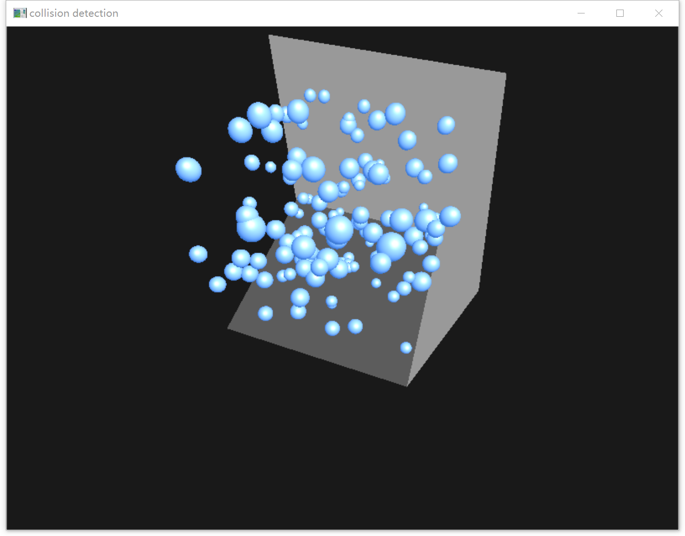

# 基于 GPU 的碰撞检测算法

**周雨豪  软件92  2018013399**

## 1 实验环境

- **操作系统：**Windows 10
- **IDE：**Visual Studio 2022
- **GPU：**NVIDIA GeForce GTX 750 Ti
- **CUDA：**12.0
- **NVIDIA-SMI：**528.02
- **OpenGL：**4.6.0
- **SM 数量：**5
- **依赖的库：**CUDA Toolkit，FreeGLUT，<math.h>

## 2 项目结构

| 文件          | 描述                                   |
| ------------- | -------------------------------------- |
| ball.hpp      | 定义了表示单个小球的类 `Ball`          |
| ballset.hpp   | 定义了表示所有小球的集合的类 `BallSet` |
| wall.hpp      | 定义了表示墙壁的类 `Wall`              |
| camera.hpp    | 定义了表示相机的类 `Camera`            |
| collision.cu  | GPU 上的碰撞检测算法实现               |
| collision.cuh | CUDA 头文件                            |
| light.hpp     | 定义了表示光线的类 `Light`             |
| main.cpp      | 入口点                                 |
| coord.hpp     | 定义了表示 3D 坐标的类 `Coord`         |

 

## 3 运行流程

main.cpp 中首先会初始化窗口，然后初始化场景中的素材，包括光照、相机、小球、墙壁等，并进行渲染，绑定键盘鼠标时间，之后进入主循环：

- 检测和处理窗口事件
- 更新所有小球运动状态（逻辑位于 ballset.hpp 和 collision.cuh）
- 渲染场景

关闭窗口后程序退出。

## 4 演示方法

运行目录 ../bin 下的 GPU_collision_detection.exe 文件，键盘 WASD 可水平移动观测点，点击鼠标左/右键拖动改变观测视角。

## 5 实验结果

演示效果见 ./video 目录下的 demo.mp4 文件。

实现了小球与小球、小球与墙壁的碰撞检测，运行截图如下

因时间原因未能完成物体的碰撞检测

 

## 6 参考内容

- CUDA 环境
  - https://zhuanlan.zhihu.com/p/488518526
  - https://quasar.ugent.be/files/doc/cuda-msvc-compatibility.html
  - https://www.cnblogs.com/liaohuiqiang/p/9791365.html
  - https://zhuanlan.zhihu.com/p/64376059
  - https://docs.nvidia.com/cuda/cuda-toolkit-release-notes/index.html
  - https://blog.csdn.net/weixin_54672021/article/details/119965884
- OpenGL
  - https://zhuanlan.zhihu.com/p/402397399
  - https://blog.csdn.net/m0_46821706/article/details/114597201
  - https://www.cnblogs.com/Fionaaa/p/15557163.html
- 碰撞检测算法
  - https://developer.nvidia.com/gpugems/gpugems3/part-v-physics-simulation/chapter-32-broad-phase-collision-detection-cuda